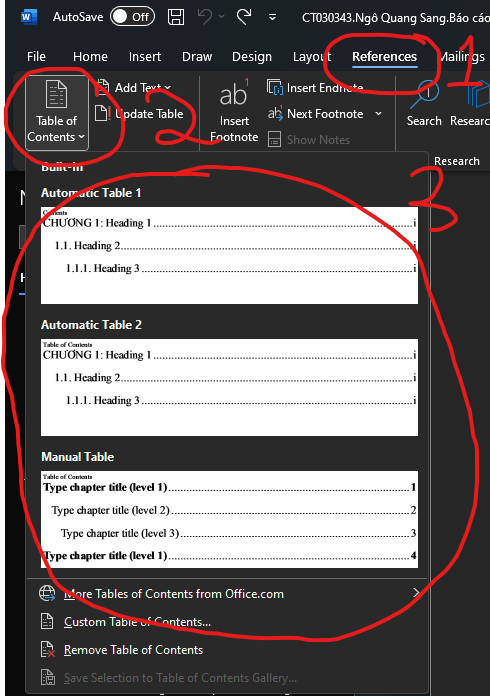
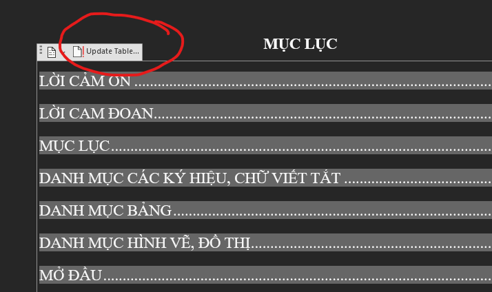
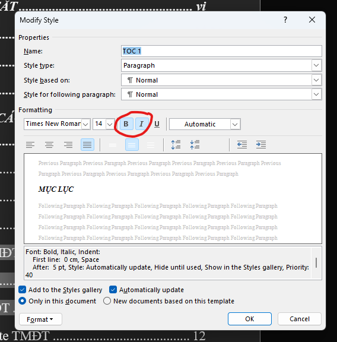
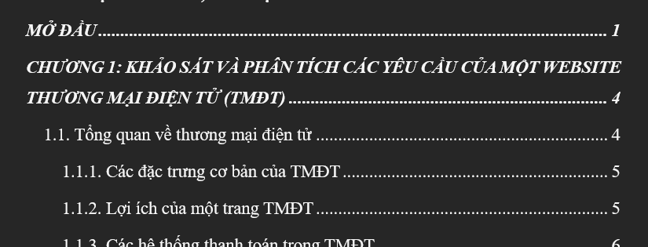
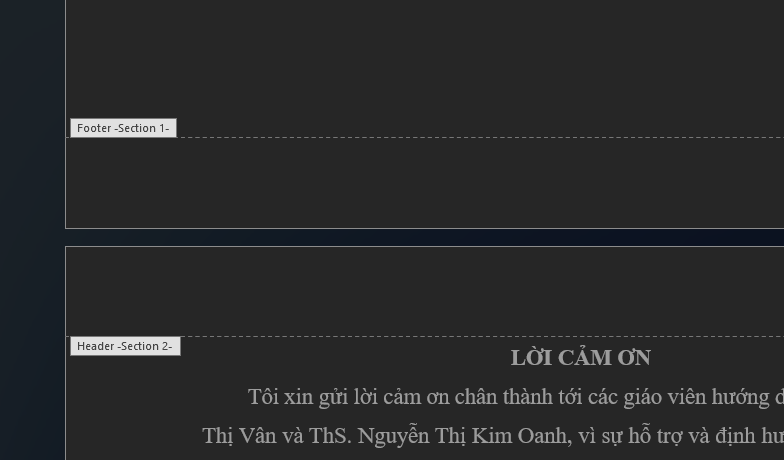
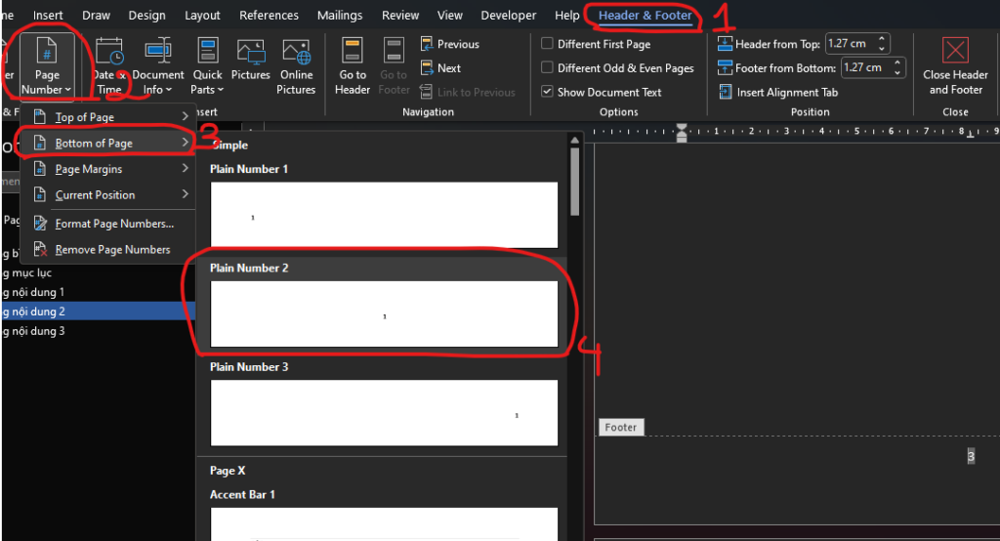
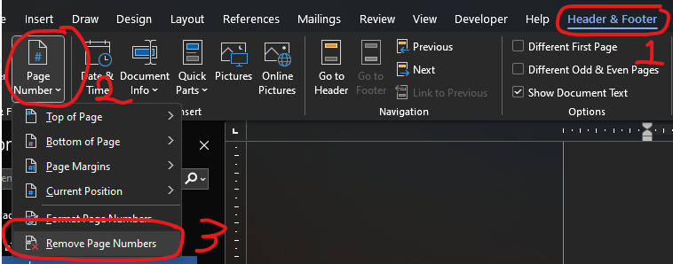

Xin chào các bạn, mình đã quay lại rồi đây. Ở phần này mình sẽ tiếp tục giới thiệu cách để config các thành phần cần thiết cho Word trước khi bắt đầu viết báo cáo tốt nghiệp sao cho chuyên nghiệp nhé 😀

Các bạn có thể theo dõi phần trước ở đây: [Hướng dẫn trình bày báo cáo đồ án tốt nghiệp trên Word (phần 1)](https://ngosangns.com/index.php/2023/07/02/huong-dan-trinh-bay-bao-cao-do-an-tot-nghiep-tren-word-phan-1/)

## **Mục lục (Table of contents)**

Mục lục là nơi hiển thị danh sách các tiêu đề trong Word (có thể kèm theo số trang). Điểm đặc biệt của mục lục trong Word là khi nhấn vào tiêu đề tương ứng thì sẽ được nhảy đến vị trí của tiêu đề đó (nếu xuất ra PDF thì chỉ việc click chuột trái, còn nếu tương tác trong Word thì cấn nhấn giữ Ctrl và click chuột trái). Việc này rất tiện cho người đọc.

Để thêm mục lục cho Word đầu tiên ta cần di chuyển con trỏ đến vị trí muốn thêm, sau đó trên top navigation ta vào mục **_References -> Table of Contents_** và chọn loại mục lục muốn thêm vào:

Vậy là ta đã thêm mục lục, nhưng mà khi ta thêm một tiêu đề mới thì mục lục không có cập nhật tiêu đề mới đó do mục lục trong Word không có cơ chế tự update tiêu đề khi có thay đổi. Do đó ta cần cập nhật một cách thủ công bằng cách nhấn vào mục lục và chọn **_Update table…_**

Vậy ta muốn thay đổi style cho mục lục thì sao? Bạn còn nhớ cách cài đặt Heading ở phần 1 chứ? Sau khi hiển thị Styles panel ta có thể cài đặt style cho mục lục với các style **_TOC 1 (Tiêu đề level 1), TOC 2 (Tiêu đề level 2),…_** cũng tương tự với Heading bằng cách chuột phải và chọn Modify:

Ví dụ mình cài đặt in đậm và in nghiêng cho tiêu đề level 1 chả hạn:

Kết quả:

## **Mục lục hình ảnh (Table of figures)**

Mục lục hình ảnh hay còn gọi tổng quan hơn là mục lục mô hình là một danh sách chứa các references dẫn đến các caption thuộc một loại label nào đó mà ta thêm vào ở các vị trí khác nhau trong Word (một số ví dụ cho label là “Hình” hoặc “Bảng”).

Để thêm caption cho một hình/bảng nào đó (để gọn hơn mình gọi chung là hình nhé) đầu tiên cần chọn vào hình muốn thêm caption. Sau đó vào mục **_References -> Insert Caption_**.

Trong hộp **_Caption_** ta chọn label cho caption. Nếu không tồn tại label muốn thêm thì ta có thể thêm bằng cách chọn vào **_New Label_** ngay bên dưới.

Mục **_Position_** là cài đặt vị trí cho caption đó nằm bên trên hay bên dưới hình ảnh. Ngoài ra ta còn có thể cài đặt đánh số bằng cách nhấn vào nút **_Numbering_**.

Kết quả:

#### 

Để ghi tiêu đề thì ta chỉ cần cách ra và ghi thôi (có thể chèn thêm dấu ngăn cách như dấu hai chấm đằng trước nếu muốn).

Kết quả (caption 2.5 đó là do mình đã cài đặt chèn chương hiện tại (chương 2) vào phần đánh số của caption (hình 5) bằng cách setup trong mục Numbering mà mình đã giới thiệu bên trên):

Sau khi đã thêm caption, tiếp theo ta cần làm đó là thêm mục lục cho hình.

Để thêm mục lục hình ảnh ta di chuyển con trỏ đến chỗ cần thêm mục lục sau đó trên top navigation ta vào mục **_References -> Insert Table of Figures_**. Trong hộp **_Table of Figures_** ta cài đặt các option hiển thị và nhấn **_OK_**:

Kết quả:

Tương tự như mục lục thì mục lục hình ảnh không có chức năng tự động cập nhật khi có sự thay đổi nội dung. Để cập nhật mục lục hình ảnh ta thực hiện:

*   Chọn vào mục lục hình ảnh muốn cập nhật.
    
*   Vào mục **_References -> Nhấn Update Table_**.
    

## **Section**

Ngoài việc chia nội dung theo trang thì Microsoft Word còn hỗ trợ chia theo Section, đây là một cách chia ngầm của Word, chức năng để làm gì thì mình sẽ hướng dẫn trong phần sau. Để có thể tạo ra một section mới thì ra vào mục **_Layout -> Breaks -> Section Breaks_** và chọn **_Next Page_**.

Sau khi đã chèn section break ở vị trí con trỏ thì khi nhấn đúp vào khu vực header/footer trong trang có chứa section break thì ta sẽ thấy trang phía sau đã được đánh section khác:

## **Đánh số trang (Page number)**

Để thêm số trang cho từng trang trong Word ta thực hiện:

*   Click đôi vào phần footer của một trang bất kỳ.
    
*   Trên top navigation sẽ hiển thị một tab mới gọi là **_Header & Footer_**. Trong tab đó ta chọn **_Page Number -> Bottom of Page_** và chọn loại hiển thị cho số trang. Thế là xong.
    

Nhưng nếu ta không muốn đánh số trang cho trang bìa thì sao?

Để làm được điều đó thì ta thực hiện:

*   Chia trang bìa và nội dung còn lại ra 2 section riêng. Ví dụ ta sẽ để trang bìa ở section 1 và nội dung còn lại ở section 2.
    
*   Ta double click vào footer của một trang bất kì trong section 2 và từ top navigation ta vào mục **_Header & Footer -> bỏ chọn Link to Previous_**. Việc này để tránh cho các trang trong section 2 bị ảnh hưởng bởi cài đặt trong section 1 do ta sẽ bỏ page number ở section 1.
    

*   Tiếp theo ta thêm page number cho section 2 như bình thường.
    
*   Ta bỏ page number cho section 1 (nếu đã có) bằng cách double click vào footer của một trang bất kỳ trong section 1 và từ top navigation ta vào mục Header & Footer -> Page Number -> Remove Page Numbers.
    

Vậy là đã xong. Ta đã bỏ việc đánh số trang cho trang bìa. Phần tiếp theo mình sẽ hướng dẫn thêm một số thủ thuật mà mình sử dụng khi viết báo cáo đồ án. Sẽ đăng tải trong thời gian sớm nhất.